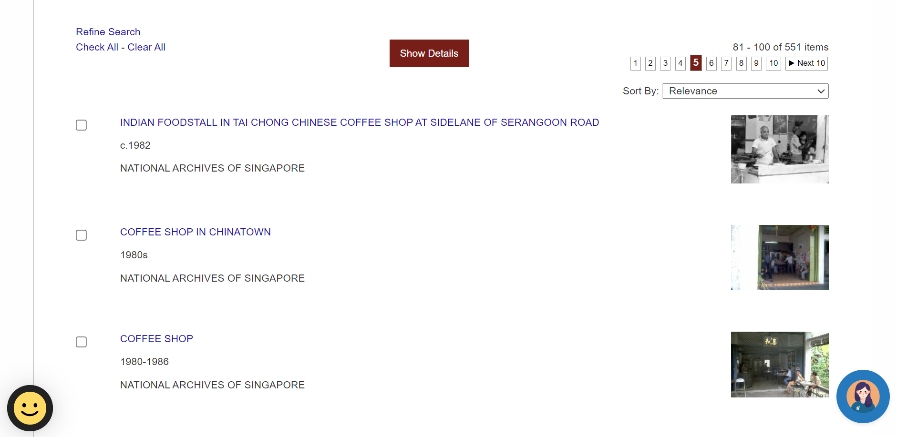
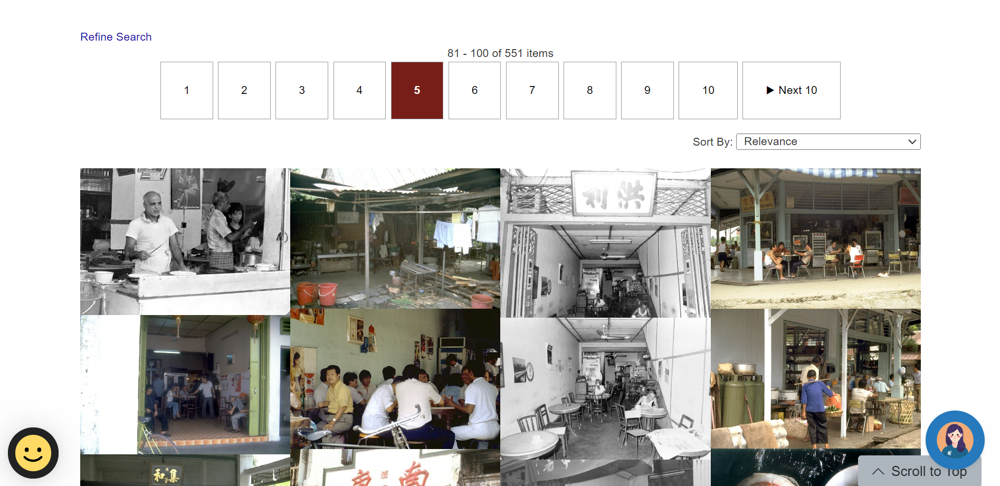

# National Archive Viewer

## About

This Chrome extension was created because I wanted to browse the photos in the [National Archive of Singapore](https://www.nas.gov.sg/archivesonline/photographs/) but found that the existing UI was not suitable for browsing.

This extension is activated when the user is on a search result page at: https://www.nas.gov.sg/archivesonline/photographs/search-result

## Features

1. Photos are displayed in a grid-system
2. High Resolution Photos are automatically downloaded
3. Left/Right Arrow keys navigate you to the previous and next page
4. Hovering over photos zooms in

## Examples

Before:

After:

Zoom Function:

## Usage

Follow the instructions [here](https://developer.chrome.com/docs/extensions/mv3/getstarted/development-basics/#:~:text=To%20load%20an%20unpacked%20extension,the%20bottom%20of%20the%20menu.) to load the National Archive Viewer as an unpacked extension.
